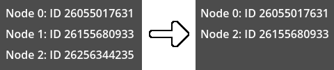

# Todo list

(This guide builds on top of [Godui's basic usage](quickstart.md#basic-usage))

Going for an even more complete example, we'll make a todo-list UI, which the user can add new tasks, set the description, mark as completed and delete then. In this guide you'll learn about UI keys, partial update and motion system.

## Create, update and delete tasks

Firstly, we need to make a way to create, update and delete tasks, we're going to use plain <span class-method-ref>Dictionary</span> to describe a single task and store multiple tasks inside another <span class-method-ref>Dictionary</span> using the task id as key:

```gdscript
## An dictionary storing currently added tasks
var tasks: Dictionary = {}

## An counter for the tasks's ids, used for indexing later
var task_id: int = 0
```

Next, we'll create the functions to create, update and delete a single task:

```gdscript
## Creates a single task
func task_create() -> void:
	# Create a dictioary describing the task name, id and if it's completed
	var task: Dictionary = {
		"name": "New task",
		"id": task_id,
		"completed": false
	}

	# Add to the tasks dictionary using task's id as key
	# and increment `task_id` by one for the next task's id
	tasks[task_id] = task
	task_id += 1

## Marks a single task as completed or not completed
func task_set_completed(id: int, completed: bool = true) -> void:
	# Get the task by it's id
	var task: Dictionary = tasks[id]

	# Mark `completed` as the passed argument
	task.completed = completed

## Sets the task's name
func task_set_name(id: int, name: String) -> void:
	# Get the task by it's id
	var task: Dictionary = tasks[id]

	# Set `name` to the passed argument
	task.name = name

## Deletes a single task by id
func task_delete(id: int) -> void:
	# Simply erase from tasks dictionary
	tasks.erase(id)
```

For initial UI development, let's create a single task after creating the UI:

```gdscript
## Called when the node is ready
func _ready() -> void:
	# Create the UI reference, then bind it to self
	ui = UI.create(self)

	# Enable processing interface every frame
	set_process(true)

	# Create a single task for test purposes
	task_create()
```

## Display a task

Now, we need a way to display a single task in the screen, let's do this by combining <span class-method-ref>Container</span>s, <span class-method-ref>LineEdit</span> and <span class-method-ref>Button</span>s. We can do this in a separate function that receives a task and the parent UI:

```gdscript
## Display a single task to the UI
func show_task(ui: UI, task: Dictionary) -> void:
	# Let's contain the task inside a PanelContainer with a HBoxContainer,
	# you can chain `add` methods to reduce variables
	var task_panel: UI = ui.add(PanelContainer).add(HBoxContainer)

	# Let's add a CheckBox for the completed property
	var task_completed_ui: UI = task_panel.add(CheckBox).prop("pressed", task.completed)

	# Now a single LineEdit for the task description, also make it fill
	# the remaining width from the HBoxContainer
	var task_name_ui: UI = task_panel.add(LineEdit).horizontal_expand_fill().prop("text", task.name)

	# Lastly a button to delete the task
	var task_delete_ui: UI = task_panel.add(Button).prop("text", "delete")
```

For the `ui_process` let's use the created function to show the task we added:

```gdscript
## Called to update the interface
func ui_process(ui: UI) -> void:
	# Let's contain multiple tasks inside a VBoxContainer, also make
	# the VBoxContainer fill the entire UI with a margin of 8 pixels
	var tasks_ui: UI = ui.add(VBoxContainer).margin(8.0)

	# Call the created function to show the only task we have (with ID 0)
	show_task(tasks_ui, tasks[0])
```

If you hit play you should see the task we added, with a CheckBox, a LineEdit with text `New task` and a button with text `delete`, but if you interact with any of then, not much happens other than the node's behaviours, but they aren't modifying the task just yet.

Before going further, let's make the `ui_process` to show all the tasks we have added:

```gdscript
## Called to update the interface
func ui_process(ui: UI) -> void:
	# Let's contain multiple tasks inside a VBoxContainer, also make
	# the VBoxContainer fill the entire UI with a margin of 8 pixels
	var tasks_ui: UI = ui.add(VBoxContainer).margin(8.0)

	# For each value in the tasks dictionary, we call the `show_task` function
	for task in tasks.values():
		show_task(tasks_ui, task)
```

## Interaction

Let's begin by making the task's checkbox change the `completed` value of the task:

```gdscript
# Let's add a CheckBox for the completed property
var task_completed_ui: UI = ui.add(CheckBox).prop("pressed", task.completed)

# Connect the `toggled` and set the task's completed value
task_completed_ui.event("toggled", func (completed: bool):
	# Set the task `completed` value to the argument passed by the signal
	task.completed = completed

	# Update the root UI
	ui.root_queue_update()
)
```

Next let's make the LineEdit change the task's name:

```gdscript
# Now a single LineEdit for the task description, also make it fill
# the remaining width from the HBoxContainer
var task_name_ui: UI = ui.add(LineEdit).horizontal_expand_fill().prop("text", task.name)

# Connect the `text_changed` signal to change the task's name
task_name_ui.event("text_changed", func (name: String):
	# Set the task `name` value to the argument passed by the signal
	task.name = name

	# Update the root UI
	ui.root_queue_update()
)
```

And finally, let's delete the task when the delete button is pressed:

```gdscript
# Lastly a button to delete the task
var task_delete_ui: UI = ui.add(Button).prop("text", "delete")

# Connect the `pressed` signal to delete the task when pressed
task_delete_ui.event("pressed", func ():
	# Delete the task from ID
	task_delete(task.id)

	# Update the root UI
	ui.root_queue_update()
)
```

Before testing it, let's add a button to add new tasks, we can add it to the same VBoxContainer that adds tasks:

```gdscript
# For each value in the tasks dictionary, we call the `show_task` function
for task in tasks.values():
	show_task(tasks_ui, task)

# Add a button to add new tasks
var new_task_ui: UI = tasks_ui.add(Button).prop("text", "new task")

# Connect the `pressed` signal to add a new task when pressed
new_task_ui.event("pressed", func ():
	# Create a new task
	task_create()

	# Update the root UI
	ui.root_queue_update()
)
```

Feel free to remove the line that adds a task right from the `_ready`.

Also, as you add more and more tasks, it would be nice to be able to scroll to show all the tasks, let's add a <span class-method-ref>ScrollContainer</span>:

```gdscript
## Display a single task to the UI
func show_task(ui: UI, task: Dictionary) -> void:
	# Let's contain the task inside a PanelContainer with a ScrollContainer and a HBoxContainer,
	# you can chain `add` methods to reduce variables
	var task_panel: UI = ui.add(PanelContainer).add(ScrollContainer).add(HBoxContainer)
```

Easy as that, Godui makes it easy to change the UI's node tree without needing changing Node references from node paths or needing to export variables.

If you hit play you should see only a button to add new task, if you press it you should see the task added as expected and pressing it more times should display even more tasks added. By pressing the task's checkbox should check and uncheck the completed value, by changing the LineEdit's text should change the task's name and lastly by pressing the delete button should remove the respective task.

## UI indexing

So far so good, but there is a small problem with the UI's implementation. Godui caches Node's references between updates to speedup the interface update, it caches by node types in the order they are being added to the parent's UI, meaning that when you delete a task in the middle of the list, the actual node tree isn't removed from the tree, instead if passes the properties from the next task to the previously deleted task and only remove the last task's Node from the tree.

This would be a problem for the performance, when you add a new node for a specific task condition, but when you delete one task before, it creates the same node again and remove the already added node, which isn't a big issue for small node count, but when you add more and more nodes in the interface, it could actually slowdown the interface's performance. 

An example of a interface update where we have three items where we render a node for, and we remove a middle item after an event, instead of caching the respective node for the remaining item, it uses the node from the deleted item:



Instead, we need a way to keep the nodes references based on the respective items, so when we remove the middle item, it updates into something like this:


TL;DR: The more nodes added in the interface without a specific way to index then between update, the more performance bottleneck you will have.

So we need a way to index the actual nodes by a specific key, luckily Godui provides a really simple way to add UIs with a key:

```gdscript
## Display a single task to the UI
func show_task(ui: UI, task: Dictionary) -> void:
	# Let's contain the task inside a PanelContainer with a HBoxContainer,
	# you can chain `add` methods to reduce variables.
	# Also make the UI's key as the task's id
	var task_panel: UI = ui.add(PanelContainer, task.id).add(HBoxContainer)
```

As simple as that, we pass a second argument to the `add` function, now the tasks's main PanelContainer is indexed between updates by the task's id, maintaining the UI's references connected to the task's ID.

## Partial UI update

Another problem we encounter with the interface, is that whenever we change a task's property and update the interface, we update the entire interface at once, which wouldn't be a problem if there wasn't the possibility of having a lot of tasks updated at the same time. So instead we need a way to update only the relevant parts of the UI, luckily Godui also provides a really simple way to do this.

Let's start by refactoring the `show_task function` to add nodes inside the `show` function of the UI, this function register a update function to the respective UI, so that we can call `queue_update` it calls this update function:

```gdscript
## Display a single task to the UI
func show_task(ui: UI, task: Dictionary) -> void:
	# Let's contain the task inside a PanelContainer with a ScrollContainer and a HBoxContainer,
	# you can chain `add` methods to reduce variables
	var task_panel: UI = ui.add(PanelContainer).add(ScrollContainer).add(HBoxContainer)

	# Let's add content dynamically inside `show`
	task_panel.show(func (ui):
		# Let's add a CheckBox for the completed property
		var task_completed_ui: UI = ui.add(CheckBox).prop("pressed", task.completed)

		# Connect the `toggled` and set the task's completed value
		task_completed_ui.event("toggled", func (completed: bool):
			# Set the task `completed` value to the argument passed by the signal
			task.completed = completed

			# Update the panel's UI
			ui.queue_update()
		)

		# Now a single LineEdit for the task description, also make it fill
		# the remaining width from the HBoxContainer
		var task_name_ui: UI = ui.add(LineEdit).horizontal_expand_fill().prop("text", task.name)

		# Connect the `text_changed` signal to change the task's name
		task_name_ui.event("text_changed", func (name: String):
			# Set the task `name` value to the argument passed by the signal
			task.name = name

			# Update the panel's UI
			ui.queue_update()
		)

		# Lastly a button to delete the task
		var task_delete_ui: UI = ui.add(Button).prop("text", "delete")

		# Connect the `pressed` signal to delete the task when pressed
		task_delete_ui.event("pressed", func ():
			# Delete the task from ID
			task_delete(task.id)

			# Here we have no option other than update the entire UI
			# to update the task list
			ui.root_queue_update()
		)
	)
```

Congratulations! You just made a complete functional todo-list interface using Godui! Here's the complete code so far for this section to analyze some missing parts:

```gdscript
extends Control

## The UI reference
var ui: UI = null

## An dictionary storing currently added tasks
var tasks: Dictionary = {}

## An counter for the tasks's ids, used for indexing later
var task_id: int = 0

## Called when the node is ready
func _ready() -> void:
	# Create the UI reference, then bind it to self
	ui = UI.create(self)

	# Enable processing interface every frame
	set_process(true)

## Called when receiving a notification
func _notification(what: int) -> void:
	# Notify the interface from the Node's notification
	if ui: ui.notification(what)

## Creates a single task
func task_create() -> void:
	# Create a dictioary describing the task name, id and if it's completed
	var task: Dictionary = {
		"name": "New task",
		"id": task_id,
		"completed": false
	}

	# Add to the tasks dictionary using task's id as key
	# and increment `task_id` by one for the next task's id
	tasks[task_id] = task
	task_id += 1

## Marks a single task as completed or not completed
func task_set_completed(id: int, completed: bool = true) -> void:
	# Get the task by it's id
	var task: Dictionary = tasks[id]

	# Mark `completed` as the passed argument
	task.completed = completed

## Sets the task's name
func task_set_name(id: int, name: String) -> void:
	# Get the task by it's id
	var task: Dictionary = tasks[id]

	# Set `name` to the passed argument
	task.name = name

## Deletes a single task by id
func task_delete(id: int) -> void:
	# Simply erase from tasks dictionary
	tasks.erase(id)

## Display a single task to the UI
func show_task(ui: UI, task: Dictionary) -> void:
	# Let's contain the task inside a PanelContainer with a HBoxContainer,
	# you can chain `add` methods to reduce variables
	var task_panel: UI = ui.add(PanelContainer, task.id).add(HBoxContainer)

	# Let's add content dynamically inside `show`
	task_panel.show(func (ui):
		# Let's add a CheckBox for the completed property
		var task_completed_ui: UI = task_panel.add(CheckBox).prop("pressed", task.completed)

		# Connect the `toggled` and set the task's completed value
		task_completed_ui.event("toggled", func (completed: bool):
			# Set the task `completed` value to the argument passed by the signal
			task.completed = completed

			# Update the panel's UI
			ui.queue_update()
		)

		# Now a single LineEdit for the task description, also make it fill
		# the remaining width from the HBoxContainer
		var task_name_ui: UI = task_panel.add(LineEdit).horizontal_expand_fill().prop("text", task.name)

		# Connect the `text_changed` signal to change the task's name
		task_name_ui.event("text_changed", func (name: String):
			# Set the task `name` value to the argument passed by the signal
			task.name = name

			# Update the panel's UI
			ui.queue_update()
		)

		# Lastly a button to delete the task
		var task_delete_ui: UI = task_panel.add(Button).prop("text", "delete")

		# Connect the `pressed` signal to delete the task when pressed
		task_delete_ui.event("pressed", func ():
			# Delete the task from ID
			task_delete(task.id)

			# Here we have no option other than update the entire UI
			# to update the task list
			ui.root_queue_update()
		)
	)

## Called to update the interface
func ui_process(ui: UI) -> void:
	# Let's contain multiple tasks inside a VBoxContainer, also make
	# the VBoxContainer fill the entire UI with margin of 8 pixels
	var tasks_ui: UI = ui.add(VBoxContainer).margin(8.0)

	# For each value in the tasks dictionary, we call the `show_task` function
	for task in tasks.values():
		show_task(tasks_ui, task)
	
	# Add a button to add new tasks
	var new_task_ui: UI = tasks_ui.add(Button).prop("text", "new task")

	# Connect the `pressed` signal to add a new task when pressed
	new_task_ui.event("pressed", func ():
		# Create a new task
		task_create()

		# Update the root UI
		ui.root_queue_update()
	)
```

Now, if you want to spice up things a bit and add some _juicy_ animations...

## Basics of animation

Firstly, let's add a simple transition animation to the tasks which moves posterior tasks smoothly whenever we delete a task inside the list:

```gdscript
## Display a single task to the UI
func show_task(ui: UI, task: Dictionary) -> void:
	# Let's contain the task inside a PanelContainer with a HBoxContainer,
	# you can chain `add` methods to reduce variables. Also add a smooth
	# transition to the panel container inside the list.
	var task_panel: UI = ui.add(PanelContainer, task.id).animate_rect().add(HBoxContainer)
```

`animate_rect` uses the RenderingServer to smoothly animate the Control's rect, this means that to the node tree there's no actual rect processing inside the tree, instead it uses `RenderingServer.canvas_item_set_transform`  to modify the CanvasItem transform inside the RenderingServer, which is separate to the actual node tree, making it full compatible to Control's ordering inside a container, for example.

Let's add this transition to the new task button too:

```gdscript
# Add a button to add new tasks and add smooth transition inside the
# task list
var new_task_ui: UI = tasks_ui.add(Button).prop("text", "new task").animate_rect()
```

Now, we're going to use the motion system to add dynamic animations to the task's interface nodes. For this guide we will make a simple rotation animation which rotates to the right when checked and rotates to the left when unchecked, but first we need to set the `pivot_offset` position, as it isn't centered at the checkbox center but at the checkbox top-left corner instead.

For this, let's set `pivot_offset` half the checkbox's size:

```gdscript
# Let's add a CheckBox for the completed property
var task_completed_ui: UI = task_panel.add(CheckBox).prop("pressed", task.completed)

# Set the checkbox's pivot_offset to center
task_completed_ui.prop("pivot_offset", task_completed_ui.ref().size * 0.5)
```

Now we can work with the motion system, let's being with a simple rotation animation:

```gdscript
# Add a animation to the checkbox
task_completed_ui.motion(func (motion: MotionRef):
	# Let's animate the `rotation` property
	motion.prop("rotation")

	# Start from the node's current rotation
	motion.from_current()

	# Rotate to a quarter of full turn during 500 milliseconds using
	# easing out transition
	motion.ease_out(TAU/4.0, 0.5)
)
```

Great! But it plays the animation right when the task is added, we don't want that, instead we want to play it only when the task is completed:

```gdscript
# Add a animation to the checkbox
task_completed_ui.motion(func (motion: MotionRef):
	# Rotates in a direction when completed
	if task.completed:
		# Let's animate the `rotation` property
		motion.prop("rotation")

		# Start from the node's current rotation
		motion.from_current()

		# Rotate to a quarter of full turn during 500 milliseconds using
		# easing out transition
		motion.ease_out(TAU/4.0, 0.5)
)
```

If you hit play and mark a task as completed, you should see the checkbox rotating to the right, but when unchecking it isn't turning back, let's change that:

```gdscript
# Rotates in a direction when completed
if task.completed:
	# Let's animate the `rotation` property
	motion.prop("rotation")

	# Start from the node's current rotation
	motion.from_current()

	# Rotate to a quarter of turn during 500 milliseconds using
	# easing out transition
	motion.ease_out(TAU/4.0, 0.5)
# Rotates back to zero when not completed
else:
	# Let's animate the `rotation` property
	motion.prop("rotation")

	# Start from the node's current rotation
	motion.from_current()

	# Rotate back to zero during 500 milliseconds using
	# easing out transition
	motion.ease_out(0.0, 0.5)
```

Great! Now if you try to mark a task as completed, it rotates to the right, perfect! Now if you uncheck the task... nothing happens?

That's because the animation's continue playing until infinity, and when we change the animation, the animation's time is already past the full animation, so we need a way to manually reset the time, so let's fix that.

First, let's store the reference to the current motion above the toggled event:

```gdscript
# Store the checkbox motion inside a dictionary (as it is passed by reference
# between callables).
var task_completed_motion: Dictionary = {"ref": null}

# Connect the `toggled` and set the task's completed value
task_completed_ui.event("toggled", func (completed: bool):
```

When calling `motion` let's set the reference:

```gdscript
# Add a animation to the checkbox
task_completed_ui.motion(func (motion: MotionRef):
	# Set the motion reference
	task_completed_motion.ref = motion
```

Now, inside the toggled event, let's call `reset` to reset the motion's animation time:

```gdscript
# Connect the `toggled` and set the task's completed value
task_completed_ui.event("toggled", func (completed: bool):
	# Set the task `completed` value to the argument passed by the signal
	task.completed = completed

	# We need to reset the motion to play another animation
	if task_completed_motion.ref:
		task_completed_motion.ref.reset()

	# Update the panel's UI
	ui.queue_update()
)
```

Ok, let's once again hit play, check the task and when unchecking it, the checkbox rotates back! Perfect!

Congratulations! Now you can animate UIs with Godui!

That's just the basic of motion system, you can chain multiple properties, animate then parallely, use different transitions, call functions, etc. More on that is detailed at [MotionRef class reference](api/motion_ref.md) and [Motion system advanced guide](guide/motion-system-advanced.md).

Here is the complete code for this section:

```gdscript
extends Control

## The UI reference
var ui: UI = null

## An dictionary storing currently added tasks
var tasks: Dictionary = {}

## An counter for the tasks's ids, used for indexing later
var task_id: int = 0

## Called when the node is ready
func _ready() -> void:
	# Create the UI reference, then bind it to self
	ui = UI.create(self)

	# Enable processing interface every frame
	set_process(true)

## Called when receiving a notification
func _notification(what: int) -> void:
	# Notify the interface from the Node's notification
	if ui: ui.notification(what)

## Creates a single task
func task_create() -> void:
	# Create a dictioary describing the task name, id and if it's completed
	var task: Dictionary = {
		"name": "New task",
		"id": task_id,
		"completed": false
	}

	# Add to the tasks dictionary using task's id as key
	# and increment `task_id` by one for the next task's id
	tasks[task_id] = task
	task_id += 1

## Marks a single task as completed or not completed
func task_set_completed(id: int, completed: bool = true) -> void:
	# Get the task by it's id
	var task: Dictionary = tasks[id]

	# Mark `completed` as the passed argument
	task.completed = completed

## Sets the task's name
func task_set_name(id: int, name: String) -> void:
	# Get the task by it's id
	var task: Dictionary = tasks[id]

	# Set `name` to the passed argument
	task.name = name

## Deletes a single task by id
func task_delete(id: int) -> void:
	# Simply erase from tasks dictionary
	tasks.erase(id)

## Display a single task to the UI
func show_task(ui: UI, task: Dictionary) -> void:
	# Let's contain the task inside a PanelContainer with a HBoxContainer,
	# you can chain `add` methods to reduce variables. Also add a smooth
	# transition to the panel container inside the list.
	var task_panel: UI = ui.add(PanelContainer, task.id).animate_rect().add(HBoxContainer)

	# Let's add content dynamically inside `show`
	task_panel.show(func (ui):
		# Let's add a CheckBox for the completed property
		var task_completed_ui: UI = task_panel.add(CheckBox).prop("pressed", task.completed)

		# Set the checkbox's pivot_offset to center
		task_completed_ui.prop("pivot_offset", task_completed_ui.ref().size * 0.5)

		# Store the task completed reference to reset it when toggled
		var task_completed_motion: Dictionary = {"ref": null}

		# Connect the `toggled` and set the task's completed value
		task_completed_ui.event("toggled", func (completed: bool):
			# Set the task `completed` value to the argument passed by the signal
			task.completed = completed

			# We need to reset the motion to play another animation
			if task_completed_motion.ref:
				task_completed_motion.ref.reset()

			# Update the panel's UI
			ui.queue_update()
		)

		# Add a animation to the checkbox
		task_completed_ui.motion(func (motion: MotionRef):
			# Set the motion reference
			task_completed_motion.ref = motion

			# Rotates in a direction when completed
			if task.completed:
				# Let's animate the `rotation` property
				motion.prop("rotation")

				# Start from the node's current rotation
				motion.from_current()

				# Rotate to a quarter of turn during 500 milliseconds using
				# easing out transition
				motion.ease_out(TAU/4.0, 0.5)
			# Rotates back to zero when not completed
			else:
				# Let's animate the `rotation` property
				motion.prop("rotation")

				# Start from the node's current rotation
				motion.from_current()

				# Rotate back to zero during 500 milliseconds using
				# easing out transition
				motion.ease_out(0.0, 0.5)
		)

		# Now a single LineEdit for the task description, also make it fill
		# the remaining width from the HBoxContainer
		var task_name_ui: UI = task_panel.add(LineEdit).horizontal_expand_fill().prop("text", task.name)

		# Connect the `text_changed` signal to change the task's name
		task_name_ui.event("text_changed", func (name: String):
			# Set the task `name` value to the argument passed by the signal
			task.name = name

			# Update the panel's UI
			ui.queue_update()
		)

		# Lastly a button to delete the task
		var task_delete_ui: UI = task_panel.add(Button).prop("text", "delete")

		# Connect the `pressed` signal to delete the task when pressed
		task_delete_ui.event("pressed", func ():
			# Delete the task from ID
			task_delete(task.id)

			# Here we have no option other than update the entire UI
			# to update the task list
			ui.root_queue_update()
		)
	)

## Called to update the interface
func ui_process(ui: UI) -> void:
	# Let's contain multiple tasks inside a VBoxContainer, also make
	# the VBoxContainer fill the entire UI with margin of 8 pixels
	var tasks_ui: UI = ui.add(VBoxContainer).margin(8.0)

	# For each value in the tasks dictionary, we call the `show_task` function
	for task in tasks.values():
		show_task(tasks_ui, task)
	
	# Add a button to add new tasks and add smooth transition inside the
	# task list
	var new_task_ui: UI = tasks_ui.add(Button).prop("text", "new task").animate_rect()

	# Connect the `pressed` signal to add a new task when pressed
	new_task_ui.event("pressed", func ():
		# Create a new task
		task_create()

		# Update the root UI
		ui.root_queue_update()
	)
```